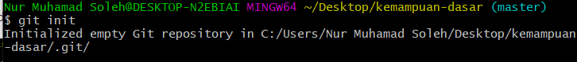
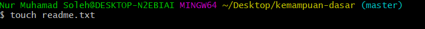
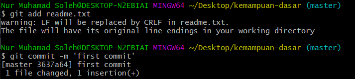
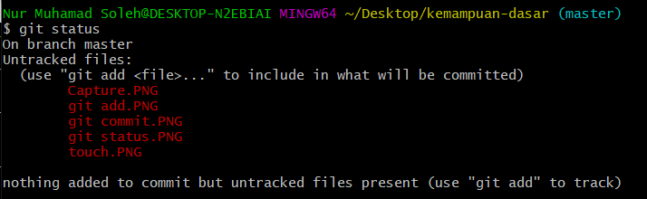
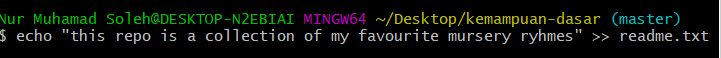
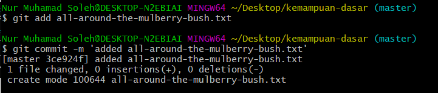
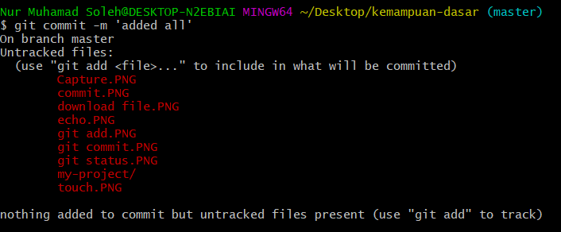
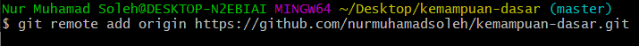
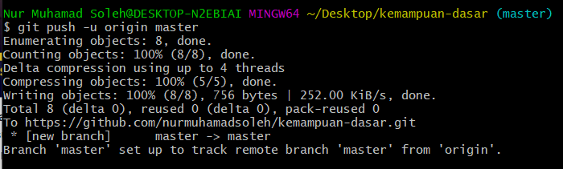

**KEMAMPUAN DASAR - 2**

1.Inisialisasi git di direktori yang telah dibuat

2.Buat satu file dengan perintah touch

3.Add dan commit file yang telah dibuat

4.Mengecek sukses atau tidaknya commit dengan git status dan git diff

5.Tambahkan keterangan untuk repo dengan menggunakan echo

6.Kemudian, commit kembali karena telah di update.

7.Selanjutnya, mendownload file yang ada untuk ke tahap selanjutnya, jalankan
perintah add dan commit.

8.Untuk menanmbahkan langsung juga bisa dengan commit satu kali operasi

9.Mengecek log atau riwayat hasil dari commit yang telah dilakukan

10.Selanjutnya, set up repo dengan local agar terhubung

11.Setelah terhubung, file yang ada di local sudah bisa di push agar tersimpan
di repository.

